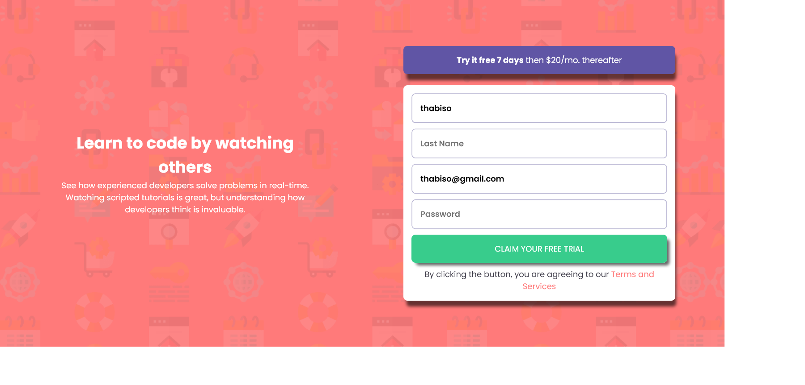

# Frontend Mentor - Intro component with sign up form solution

This is a solution to the [Intro component with sign up form challenge on Frontend Mentor](https://www.frontendmentor.io/challenges/intro-component-with-signup-form-5cf91bd49edda32581d28fd1). Frontend Mentor challenges help you improve your coding skills by building realistic projects.

## Table of contents

- [Overview](#overview)
  - [The challenge](#the-challenge)
  - [Screenshot](#screenshot)
  - [Links](#links)
- [My process](#my-process)
  - [Built with](#built-with)
  - [What I learned](#what-i-learned)
- [Author](#author)

**Note: Delete this note and update the table of contents based on what sections you keep.**

## Overview

### The challenge

Users should be able to:

- View the optimal layout for the site depending on their device's screen size
- See hover states for all interactive elements on the page
- Receive an error message when the `form` is submitted if:
  - Any `input` field is empty. The message for this error should say _"[Field Name] cannot be empty"_
  - The email address is not formatted correctly (i.e. a correct email address should have this structure: `name@host.tld`). The message for this error should say _"Looks like this is not an email"_

### Screenshot




### Links

- Solution URL: [Solution link](https://github.com/SefalaThabiso/intro-component-with-signup-form-master)
- Live Site URL: [Add live site URL here](https://sefalathabiso.github.io/intro-component-with-signup-form-master/)

## My process

### Built with

- Semantic HTML5 markup
- CSS custom properties
- Flexbox
- CSS Grid
- Mobile-first workflow
- vanilla javascript

**Note: These are just examples. Delete this note and replace the list above with your own choices**

### What I learned

I learned a lot about javascript, and i'm improving

To see how you can add code snippets, see below:

````
```js
function validateInputs() {
  const firstName = firstNameInput.value.trim();
  const lastName = lastNameInput.value.trim();
  const email = emailInput.value.trim();
  const password = passwordInput.value.trim();

  if (firstName === "") {
    error(firstNameInput, "First name is required");
  } else {
    success(firstNameInput);
  }

  if (lastName === "") {
    error(lastNameInput, "Last name is required");
  } else {
    success(lastNameInput);
  }

  if (email === "") {
    error(emailInput, "Email is required");
  } else if (!isValidEmail(email)) {
    error(emailInput, "email not valid");
    console.log("email not valid");
  } else {
    success(emailInput);
  }

  if (password === "") {
    error(passwordInput, "Password is required");
  } else {
    success(passwordInput);
  }
}

````

If you want more help with writing markdown, we'd recommend checking out [The Markdown Guide](https://www.markdownguide.org/) to learn more.

**Note: Delete this note and the content within this section and replace with your own learnings.**

## Author

- Frontend Mentor - [@yourusername](https://www.frontendmentor.io/profile/sefalathabiso)
